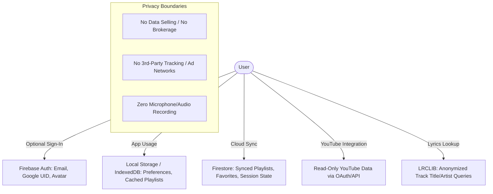

# Context Specification: Privacy Policy & Terms of Service Generator

> **Document Version:** 1.0.0  
> **Target Products:** Auralis Web Application (`https://auralis-music.web.app/`), Android APK, and associated open-source repositories/APIs.  
> **Document Purpose:** This context specification contains the complete technical, operational, architectural, and legal parameters required to draft legally sound, comprehensive, and enforceable **Privacy Policy** and **Terms of Service** documents complying with global regulations (GDPR, CCPA/CPRA, COPPA, DMCA, and Google/YouTube API Developer Policies).

---

## 1. Company & Entity Information

| Field | Value / Placeholder | Notes |
| :--- | :--- | :--- |
| **Legal Entity Name** | `Auralis Open Source Project` / `[Legal Company/Individual Name]` | If registered company (LLC, Inc., Ltd.), specify here |
| **Operating Brand Name** | `Auralis` | Product trademark / wordmark |
| **Registered Address / Location** | `[Full Physical Mailing Address]` | Mandatory for GDPR/CCPA & DMCA notices |
| **Country & Jurisdiction** | `[Country, e.g., United States / India / Germany / United Kingdom]` | Determines governing law and dispute venue |
| **Governing State / Province** | `[State / Province / District]` | e.g., California, Delaware, Karnataka, etc. |
| **Official Contact Email** | `privacy@auralis.app` / `support@auralis.app` / `[Contact Email]` | General inquiries & support |
| **Data Protection Officer (DPO) / Privacy Lead** | `privacy@auralis.app` / `[DPO Email]` | Dedicated endpoint for data subject requests |
| **DMCA Designated Agent Email** | `dmca@auralis.app` / `[DMCA Email]` | Designated point of contact for copyright claims |
| **Official Website URL** | `https://auralis-music.web.app/` | Production domain |
| **Source Code Repository** | `https://github.com/shreyanshchoubey09/Auralis` | Open-source upstream repository |

---

## 2. Product Overview & Architecture

### 2.1 Core Functionality
- **Type of Application:** Modern open-source music streaming client, playlist manager, and synchronized lyrics visualizer.
- **Platforms Supported:**
  - Progressive Web App (PWA) / Web Client
  - Android Client (APK / Play Store if applicable)
  - Desktop Client (Electron / Tauri if applicable)
- **Monetization Model:**
  - 100% Free and Open-Source Software (FOSS).
  - No subscription fees, no paywalls, no in-app purchases, and no third-party ad networks (e.g., Google AdSense, AdMob).
- **Core Capabilities:**
  1. **Audio Streaming & Playback:** Client-side streaming integration with public streaming services and YouTube API.
  2. **Synchronized Lyrics:** Fetching time-synced and plain-text lyrics via public open lyric providers (e.g., LRCLIB).
  3. **Playlist Management:** Creating, importing, organizing, and caching custom playlists and favorite tracks.
  4. **YouTube Playlist Importer:** Seamlessly parsing and importing public or user-authenticated YouTube playlists.
  5. **"Listen Together" (Real-time Sync):** Ephemeral peer/room-based multi-user listening sessions synchronized via real-time WebSocket/Firestore channels.
  6. **Local & Cloud Library Sync:** Optional cloud synchronization of user preferences, history, and playlists.

---

## 3. Data Processing & Privacy Policy Matrix

### 3.1 Data We Collect (and Data We DO NOT Collect)

| Data Category | Specific Data Points | Collection Method | Purpose / Legal Basis | Storage Location & Retention |
| :--- | :--- | :--- | :--- | :--- |
| **Identity Data (Optional)** | Display name, Email address, Profile avatar URL, Unique User ID (UID) | Directly provided via Google OAuth or Email Sign-in | Account creation, multi-device cloud sync (GDPR Art. 6(1)(b) - Contract Performance) | Firebase Authentication (US/Global Cloud). Retained until account deletion. |
| **User Library Data** | Custom playlists, liked songs, playback history, audio EQ settings | Generated by user actions | Providing core playlist management features | Stored locally (IndexedDB) & synced to Cloud Firestore if signed in. |
| **Real-time Session Data** | Room ID, Host UID, Participant UIDs, Current Track ID, Playback Timestamp | Ephemeral session creation in "Listen Together" | Enabling synchronized group audio playback | Ephemeral in-memory / Firestore document; purged immediately upon room closure. |
| **YouTube Integration Data** | YouTube Channel ID, Public Playlist metadata, Read-only video IDs | User-initiated OAuth consent flow or public URL input | Importing user playlists from YouTube | Stored in client memory / synced library. **Never shared or transferred.** |
| **Technical & Device Data** | Browser type, OS version, rough IP address (server-level only), screen dimensions | Automatically sent via standard HTTP headers | Routing requests, DDoS protection, CDN delivery | Ephemeral server logs; purged periodically (max 30-90 days). |
| **Telemetry & Analytics** | Crash stack traces (anonymized), error codes | Opt-in / Standard Firebase Crashlytics (if enabled) | App stability, bug fixing, performance monitoring | Aggregated, non-personally identifiable. |
| **Prohibited / Non-Collected Data** | Precise GPS location, biometric data, payment card info, microphone audio, contacts, clipboard | **NEVER COLLECTED** | N/A | N/A |

---

## 4. Third-Party Integrations & Sub-Processors

| Service / Sub-processor | Role & Data Accessed | Purpose | Privacy Policy & Compliance Links |
| :--- | :--- | :--- | :--- |
| **Google Firebase** (Auth, Firestore, Hosting) | UID, Email, Synced Playlists, IP address | Cloud infrastructure, user authentication, real-time database | [Firebase Privacy](https://firebase.google.com/support/privacy) (SOC 2, ISO 27001, GDPR compliant) |
| **Google / YouTube API Services** | Read-only YouTube user profile, playlist metadata, video identifiers | Playlist import, track metadata search | [Google Privacy Policy](https://policies.google.com/privacy) & [YouTube Terms of Service](https://www.youtube.com/t/terms) |
| **LRCLIB** (or alternate lyrics API) | Track Title, Artist Name, Duration (No PII) | Fetching synchronized LRC lyrics | Public metadata lookup; no personal user tracking |
| **GitHub** (Releases & Issues) | Public GitHub profile when submitting issues/PRs | Bug tracking, APK distribution | [GitHub Privacy Statement](https://docs.github.com/en/site-policy/privacy-policies/github-privacy-statement) |

---

## 5. Regulatory Compliance & Mandatory Legal Clauses

### 5.1 YouTube API Services & Google User Data Policy Compliance
> **CRITICAL COMPLIANCE REQUIREMENT:** To prevent revocation of YouTube API quotas and comply with Google API Services User Data Policy:
1. **Explicit Notice:** The Privacy Policy and Terms of Service must prominently state that Auralis utilizes YouTube API Services.
2. **Acceptance of YouTube Terms:** Users must be explicitly informed that by using YouTube features within Auralis, they agree to be bound by the **[YouTube Terms of Service](https://www.youtube.com/t/terms)**.
3. **Link to Google Privacy Policy:** Must provide a direct link to the **[Google Privacy Policy](http://policies.google.com/privacy)**.
4. **Data Access & Storage Limitation:** Must clearly state that Auralis only requests **read-only** access to YouTube data required for playlist importing, does **not** store or cache YouTube user data beyond necessary local playback sessions, and does **not** share YouTube user data with external third parties or AI model trainers.
5. **Revocation Mechanism:** Must provide instructions and links for users to revoke Auralis's access to their Google/YouTube data via the **[Google Security Settings page](https://security.google.com/settings/security/permissions)**.

### 5.2 GDPR / UK GDPR Compliance (European Users)
- **Legal Bases:** 
  - *Consent (Art. 6(1)(a)):* Optional sign-in, YouTube OAuth linkage.
  - *Performance of a Contract (Art. 6(1)(b)):* Delivering core app features, cloud playlist synchronization.
  - *Legitimate Interests (Art. 6(1)(f)):* Ensuring platform security, preventing abuse.
- **Data Subject Rights:** Explicit instructions on exercising rights under GDPR:
  - Right of Access (Art. 15)
  - Right to Rectification (Art. 16)
  - Right to Erasure / "Right to be Forgotten" (Art. 17)
  - Right to Data Portability (Art. 20) — e.g., JSON export of playlists
  - Right to Object & Restriction of Processing (Arts. 18 & 21)
  - Right to lodge a complaint with an EU Supervisory Authority.
- **International Data Transfers:** Utilization of Standard Contractual Clauses (SCCs) via Firebase / Google Cloud infrastructure.

### 5.3 CCPA / CPRA Compliance (California Consumers)
- **"Do Not Sell or Share My Personal Information":** Auralis **does not sell, rent, or share** personal information for cross-context behavioral advertising.
- **12-Month Disclosure:** Breakdown of categories of personal information collected, sources, business purposes, and third-party disclosures.
- **Consumer Rights:** Right to know, right to delete, right to correct, right to non-discrimination.

### 5.4 COPPA & Minors’ Privacy
- **Age Restriction:** Auralis is not directed at children under the age of 13 (or under 16 in certain EU jurisdictions).
- **Proactive Protection:** We do not knowingly collect personal information from children. If discovered, such accounts and data are purged immediately.

---

## 6. Terms of Service Ground Rules & Clauses

### 6.1 Acceptance & Eligibility
- Users must be at least 13 years old (or the legal minimum age in their territory).
- Continued use of the Web App, APK, or services constitutes unconditional acceptance of the Terms and Privacy Policy.

### 6.2 License & Open-Source Codebase
- **Codebase License:** The source code of Auralis is released under the **[GPL-3.0 / MIT / Apache 2.0 - Specify License]** license.
- **Brand & Trademarks:** The name "Auralis", the Auralis logo, visual UI assets, branding, and domain names remain the proprietary intellectual property of the project maintainers and are protected by applicable trademark laws.

### 6.3 Third-Party Audio, Streaming & Copyright Disclaimer (Crucial for Music Apps)
- **Non-Hosting Disclaimer:** Auralis is a software client interface and player tool. Auralis **does not host, store, index, or distribute any copyrighted music, audio files, or media on its own servers**.
- **Source Attribution:** All music streaming playback is routed directly from third-party open web sources or public/authorized API endpoints (e.g., YouTube).
- **Intellectual Property Rights:** All rights, titles, and intellectual property in streamed music, artist cover art, album assets, and lyrics belong exclusively to their respective copyright owners, record labels, artists, and publishing entities.
- **Fair Use & Client Utility:** Auralis operates strictly as an intermediary interface facilitating access to legally accessible public streams.

### 6.4 DMCA / Copyright Infringement Takedown Policy
- Clear, standardized DMCA Notice and Takedown procedure with required elements (identification of copyrighted work, infringing material link/location, statement of good faith, physical/electronic signature).
- Designated Copyright Agent contact: `dmca@auralis.app`.

### 6.5 Acceptable Use Policy (Prohibited Activities)
Users explicitly agree NOT to:
1. Use Auralis to violate copyright, trademark, or any applicable international laws.
2. Circumvent, disable, or interfere with security-related features, DRM protections, or API rate limits.
3. Use automated bots, scrapers, or scripts to flood or disrupt Auralis or connected APIs.
4. Broadcast hate speech, harassment, illegal media, or abusive content in public "Listen Together" room names or chat features.
5. Attempt unauthorized access to other user accounts or Firebase backend infrastructure.

### 6.6 "Listen Together" Feature Disclaimer
- "Listen Together" sessions are user-created. Room hosts and participants are solely responsible for interactions and communications within shared rooms.
- Project maintainers reserve the right to terminate room sessions that violate acceptable use standards.

### 6.7 Warranty Disclaimers & Limitation of Liability
- **"AS IS" & "AS AVAILABLE":** The application is provided without warranties of any kind, express or implied (fitness for a particular purpose, uptime, accuracy of lyrics/metadata, continuous API availability).
- **Limitation of Liability:** To the maximum extent permitted by law, Auralis maintainers and contributors shall not be liable for indirect, incidental, punitive, or consequential damages resulting from the use or inability to use the service.

### 6.8 Termination & Account Deletion
- Users may terminate their account and delete synced data at any time via in-app account controls.
- Maintainers reserve the right to suspend or terminate access for users who violate the Terms of Service.

### 6.9 Governing Law & Dispute Resolution
- **Jurisdiction:** Governed by the laws of `[Jurisdiction, e.g., State of California, United States / State of Karnataka, India]`.
- **Arbitration / Class Action Waiver (Optional/Standard for US):** Standard clause requiring individual dispute resolution where permitted by applicable law.

---

## 7. Instructions for Legal Document Generators & AI Drafters

When generating the final markdown or HTML for the **Privacy Policy** and **Terms of Service**:
1. **Maintain Professional, Clear, and Plain-English Structure:** Use clear section headings, bulleted lists, and structured summary callout boxes for readability.
2. **Never Omit Third-Party API Disclosures:** Always include the complete YouTube API and Google Privacy Policy disclosure blocks.
3. **Include Contact Channels:** Ensure every right (GDPR deletion, DMCA takedown, data inquiry) specifies a direct email endpoint (e.g., `privacy@auralis.app`, `dmca@auralis.app`).
4. **Match Visual Design System:** If outputting as HTML, ensure compatibility with Auralis design tokens (`variables.css`, `legal.css`, dark-mode aesthetics).

---

## 8. Quick Configuration Checklist (Fill in before final generation)

- [ ] Legal Entity Name: `____________________________`
- [ ] Registered Jurisdiction: `____________________________`
- [ ] DPO / Privacy Contact Email: `____________________________`
- [ ] DMCA Agent Email: `____________________________`
- [ ] Open Source License Type: `[e.g., GPL v3 / MIT / Apache 2.0]`
- [ ] Firebase Project Region: `[e.g., US-Central / Global]`
- [ ] Effective / Last Updated Date: `[e.g., August 24, 2026]`
